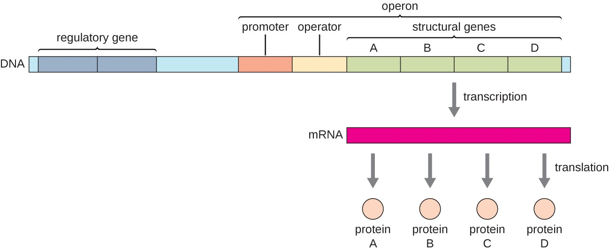

# Operon analysis

## Background
In the chromosome of *E. coli*, as in other bacteria, genes are organized in *operons*. These are typically groups of functionally-related genes that are regulated as a single unit. Under the regulation of the same promoter, the genes that make up an operon are transcribed together, yielding a single molecule of mRNA ("polycistronic").

(*Figure taken from
[here](https://courses.lumenlearning.com/suny-microbiology/chapter/gene-regulation-operon-theory)*)

## Goal

The purpose of these scripts is to facilitate the handling and analysis of operon sequences. 

Some parameters of interest:
- GC-content and length, which can be determined for any nucleotide sequence, independent of whether it includes coding regions
- average codon adaptation index (a parameter that, by definition, only applies to coding regions)

## Implementation

The `GenomeLocation` class is used to hold the information of a *continuous* segment of the genome. It is instantiated with a list of `Bio.SeqFeature.FeatureLocation` objects (from the `biopython` package), which may or may not be immediately adjacent to each other. For example, if the first `FeatureLocation` object covers nucleotides [100 : 400], and the second covers [450 : 550], then `GenomeLocation` will retrieve from the provided genome the nucleotide sequence that covers entire span of the two others, i.e. [100 : 550]. 

Using the information that was stored in the `GenomeLocation` objects (nucleotide sequence, strand direction), we can then create instances of `Gene` and/or `Operon`.

The `Operon` object accepts a list of one or more instances of `Gene` upon instantiation. Although each `Gene` has its own nucleotide sequence, we also need to provide the nucleotide sequence of the entire operon, because that not only includes the sequences of the individual genes, but also the non-coding regions between them.

## Note
Code works with `biopython v1.78` but fails with the most recent version (`v1.84`).